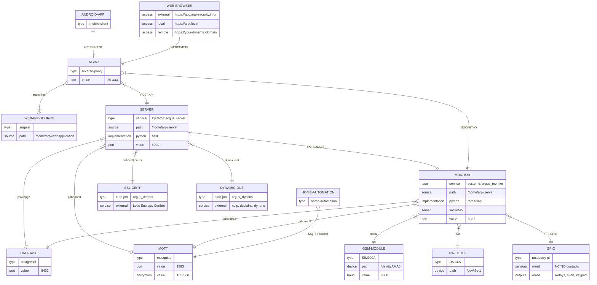

    <a href="../" class="nav-button">← Back to Developers</a>
    <button class="nav-button fullscreen-btn" onclick="toggleFullscreen()">⛶ Fullscreen</button>

```mermaid
erDiagram
    %% Client Layer
    WEB-BROWSER ||--|| NGINX : "HTTPS/HTTP"
    ANDROID-APP ||--|| NGINX : "HTTPS/HTTP"
    
    %% Web Infrastructure Layer
    NGINX }|--|{ WEBAPP-SOURCE : "static files"
    NGINX }|--|| SERVER : "REST API"
    NGINX }|--|| MONITOR : SOCKET-IO
    
    %% Client Applications
    WEB-BROWSER {
        access external "https://app.arpi-security.info/"
        access local "https://arpi.local"
        access remote "https://your-dynamic-domain"
    }
    ANDROID-APP {
        type mobile-client
    }

    HOME-AUTOMATION {
        type home-automation

    }

    HOME-AUTOMATION }|--|| MQTT : "MQTT Protocol"
    
    %% Application Services Layer
    SERVER ||--|| MONITOR : IPC-SOCKET
    SERVER {
        type service "systemd: argus_server"
        source path "/home/arpi/server"
        implementation python "flask"
        port value "5000"
    }
    MONITOR {
        type service "systemd: argus_monitor"
        source path "/home/arpi/server"
        implementation python "threading"
        server socket-io
        port value "8081"
    }
    
    %% Data Storage Layer
    MONITOR }|--|| DATABASE : psycopg2
    SERVER }|--|| DATABASE : psycopg2
    DATABASE {
        type postgresql
        port value "5432"
    }
    
    %% Web Presentation Layer
    NGINX {
        type reverse-proxy
        port value "80-443"
    }
    WEBAPP-SOURCE {
        type angular
        source path "/home/arpi/webapplication"
    }
    
    %% Communication Layer
    MONITOR }|--|| MQTT : "paho-mqtt"
    SERVER }|--|| MQTT : "paho-mqtt"
    MQTT {
        type mosquitto
        port value "1883"
        encryption value "TLS/SSL"
    }
    
    %% Hardware Interface Layer
    MONITOR }|--|| GSM-MODULE : serial
    MONITOR }|--|| HW-CLOCK : i2c
    MONITOR }|--|| GPIO : RPi-GPIO
    
    GSM-MODULE {
        type SIM900A
        device path "/dev/ttyAMA0"
        baud value "9600"
    }
    HW-CLOCK {
        type DS1307
        device path "/dev/i2c-1"
    }
    GPIO {
        type raspberry-pi
        sensors wired "NC/NO contacts"
        outputs wired "Relays, siren, keypad"
    }
    
    %% External Services Layer
    SERVER }|--|| SSL-CERT : ssl-certificates
    SERVER }|--|| DYNAMIC-DNS : "ddns-client"
    
    SSL-CERT {
        type cron-job "argus_certbot"
        service external "Let's Encrypt, Certbot"
    }
    DYNAMIC-DNS {
        type cron-job "argus_dyndns"
        service external "noip, duckdns, dyndns"
    }
```

