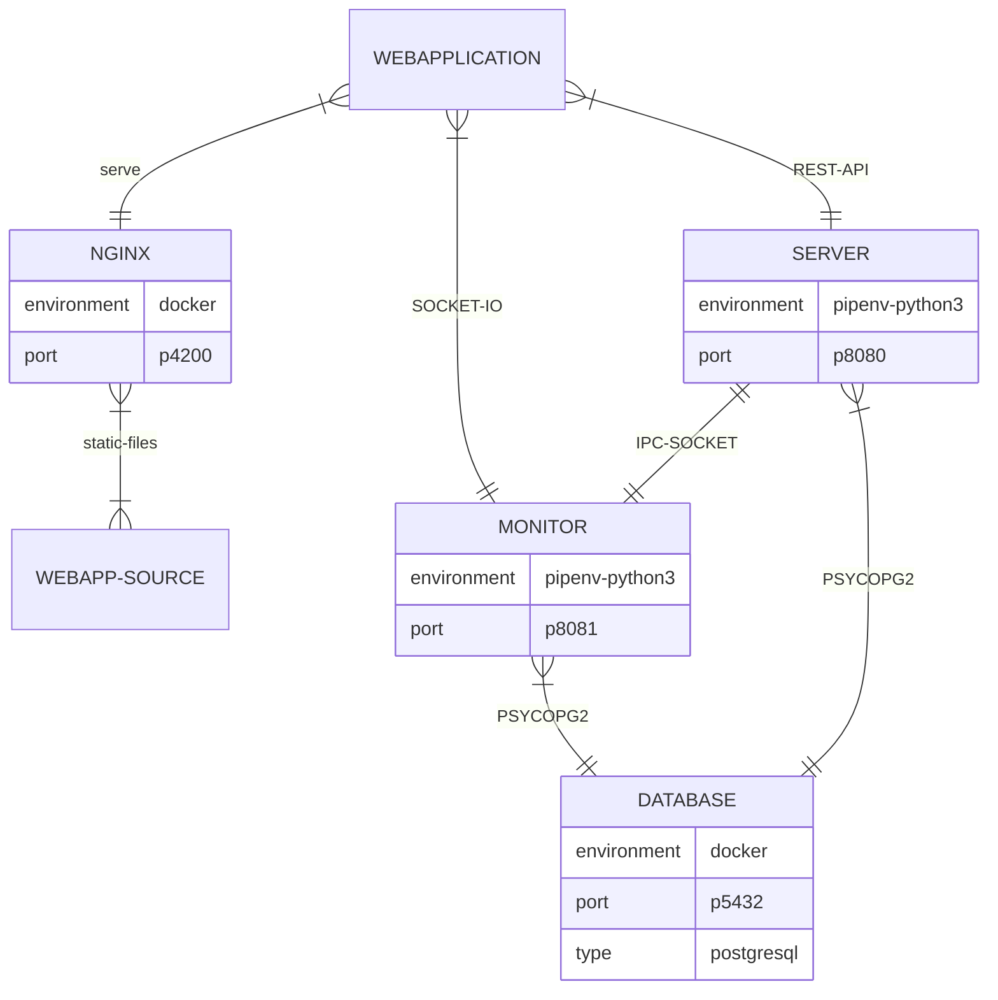
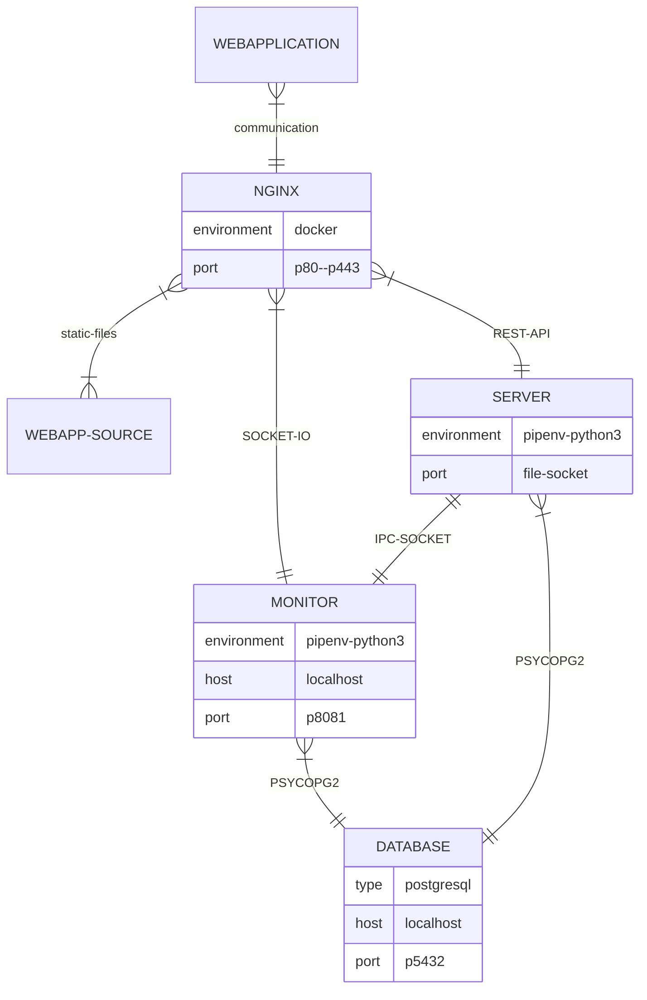

The backend system has three major components:

1. The server provides the REST API to communicate with the security system.
2. The monitor implements the main functionality (IO handling, RTC, GSM...).
3. PostgreSQL database for storing persistent information.


## Source code

The source code of the backend system:
[https://github.com/ArPIHomeSecurity/arpi_server](https://github.com/ArPIHomeSecurity/arpi_server).
It is a sub-module of the arpi_management project:
[https://github.com/ArPIHomeSecurity/arpi_management.git](https://github.com/ArPIHomeSecurity/arpi_management.git)

You find how to get the source code [here](index.md#getting-the-code)!


## Local/development architecture



## Production architecture



## Preparing the database for development

When you want to run the system on your local machine you have to prepare the database content first.
The database needs a password for the service user (called argus). You have to update the value 
for DB_PASSWORD in server/etc/secrets.env.

```bash
# start the database
./scripts/start_database.sh
# prepare the users and tables
pipenv run flask init-db
pipenv run flask migrate
pipenv run flask upgrade
# prepare a configuration
pipenv run src/data.py -d -c test_01
```

## Starting the backend services in development mode

You can run the backend services in development mode locally with mock adapters.

```bash
# go the server folder
cd server
# start the database
./scripts/start_database.sh
# start the REST API
pipenv run flask run
# or
pipenv run start-server

# in another terminal start the monitoring service
pipenv run python -d -s -m monitor
# or
pipenv run start-monitor
```

REST API is available on: http://localhost:8080

## Deploying the backend services to Raspberry

```bash
# go the arpi_management project
pipenv run ./install.py -vpe prod server
pipenv run ./install.py -vpe prod monitor
```

## Starting the backend services in production mode

On the Raspberry PI the backend services can be managed as systemd services.

```bash
sudo systemctl start argus_server
sudo systemctl start argus_monitor
```
