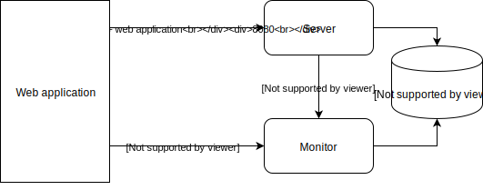
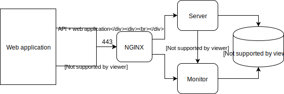

The backend system has three major components:

1. The server provides the REST API to communicate with the web application
2. The monitor implements the main functionality (IO handling, RTC, GSM...)
3. Postgres database for storing persistent information

## Local development



## Production architecture



## Preparing the database for development

When you want to run the system on your local machine you have to prepare the database content first.
The database needs a password for the service user (called argus). You have to update the value 
for DB_PASSWORD in server/etc/secrets.env.

```bash
# start the database
./scripts/start_database.sh
# prepare the users and tables
pipenv run flask init-db
pipenv run flask migrate
pipenv run flask upgrade
# prepare a configuration
pipenv run src/data.py -d -c test_01
```

## Building the web application

Before using the application you have to build the web application for development mode.
See [here](web_application.md#building-for-development)!

## Starting the backend services in development mode

You can run the backend services in development mode locally with mock adapters.

```bash
# go the server folder
cd server
# start the database
./scripts/start_database.sh
# start the REST API (it also serves the web application)
pipenv run flask run -p 8080

# in another terminal start the monitoring service
pipenv run python -d -s -m monitoring
```

Open the application on: http://localhost:8080

## Starting the backend services in production mode

On the Raspberry PI the backend services can be managed as systemd services.

```bash
sudo systemctl start argus_server
sudo systemctl start argus_monitor
```
