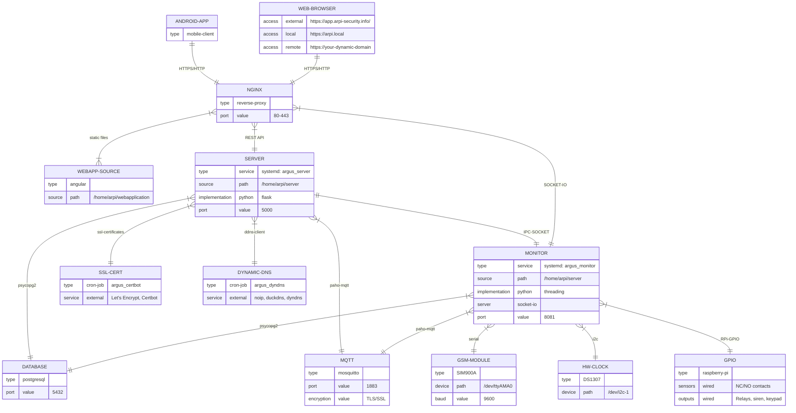

Help for developers/contributors.

!!! note
    The development on the Raspberry PI can be time consuming.
    Use your pc for development and deploy the code changes to a Raspberry PI.

## Getting the code

Open a terminal, navigate into your working directory and run the following command:
```bash
# cloning the repositories
git clone --recurse-submodules https://github.com/ArPIHomeSecurity/arpi_management.git

# switch to the development branch
git checkout dev_vXXXX
git submodule foreach git checkout dev_vXXXX

# switch to a released version
git checkout vXXXX
git submodule foreach git checkout vXXXX
```
This command will download the source code of management project of
the ArPI Home security system with the server and the web application components.

```
+ arpi_management: managing the software components
|--arpi_server: backend
|--arpi_webapplication: frontend
```

## Prerequisites for development

### Core Requirements
* **Python 3.11+** - Backend development with modern async support
* **Python pipenv** - Dependency management for server and management tools
* **Node.js 18+** - Frontend development with latest LTS features
* **Docker & Docker Compose** - Containerized development environment
* **Git** - Version control with submodule support

### Platform-Specific Dependencies

#### For Backend Development (PyGObject on Ubuntu/Debian)
```bash
sudo apt install \
    gcc \
    libgirepository1.0-dev \
    libcairo2-dev \
    pkg-config \
    python3-dev \
    gir1.2-gtk-3.0 \
    postgresql-client \
    redis-tools
```

#### Environment Setup

**Backend Environment (Python)**
```bash
cd server
pipenv install --dev
pipenv shell
```

**Frontend Environment (Angular)**
```bash
cd webapplication
npm install --dev

# Install Angular CLI globally if not present
npm install -g @angular/cli@18
```

**Database Environment (Docker)**
```bash
cd server
./scripts/start_database.sh
```

**MQTT Environment (Docker)**
```bash
cd server
./scripts/start_mqtt.sh
```


## Features

### Hardware clock

The software is configured to use a DS1307 hardware clock. The configuration is prepared
during the installation of the board (arpi_management/scripts/install_environment.sh).

The hardware clock is updated every hour from system clock and updates
the system clock on reboot (arpi_management/arpi_server/etc/cron/hwclock).

### GSM module

The software is configured to work with a GSM module (tested with SIM900A) on serial port /dev/ttyAMA0 9600 Baud.
The console on serial port is disabled.

### NoIP

You can use a NoIP provider for accessing the security system remotely
on the same domain name.

### Certbot

You can switch the connection of the web application to a signed HTTPS connection
with the help of Certbot.


## System Architecture

Full production architecture of the ArPI Home Security System is shown below.
