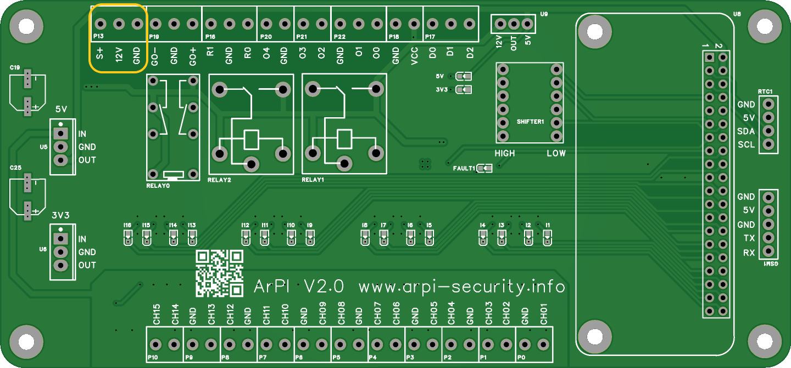
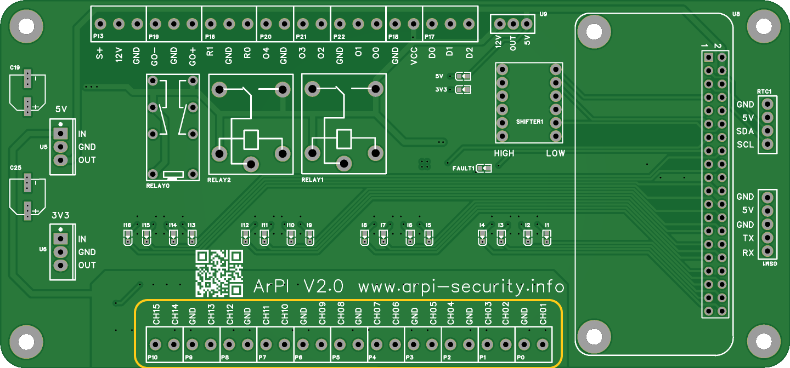
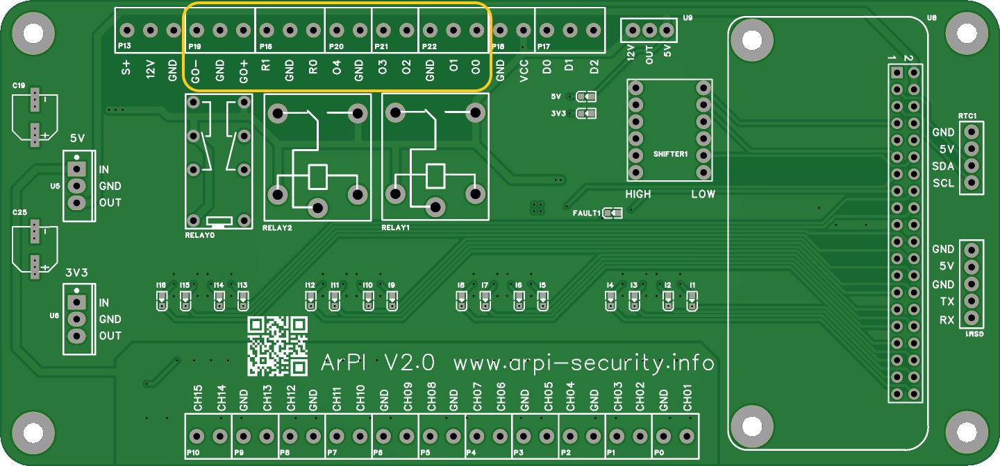
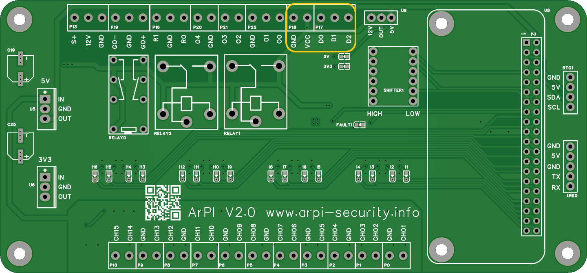
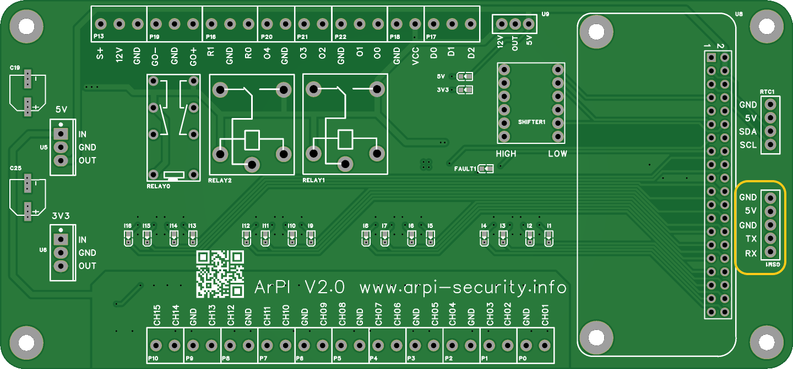
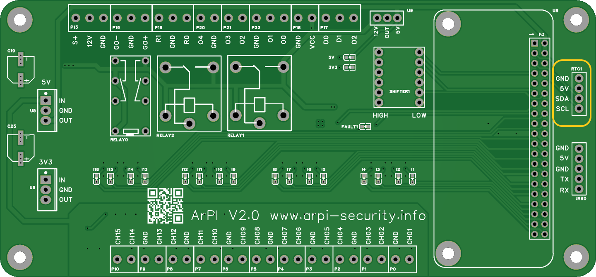

You can use the ArPI board for replacing the main board of an existing security system or building a new.

For that you need the following components:

* power supply (SCP-35/50-12 UPS)
* GSM module (SIM900)
* RTC module (DS3231)
* Wiegand keypad (Wiegand 26/34)

You can reuse the following components from the existing system:

* sensors
* syren

## Connect power supply

You need a 12V 5A power supply preferred with UPS battery backup (SCP-35/50-12 UPS).
In case of an UPS power supply you can use the "S+" input for identifying the power outage by
pulling it to ground.

{: style="height:150px;"}

## Connect sensors

Sensors can be connected with NC/NO connections.

{: style="height:150px;"}

## Connect syren/outputs

The syren can be connected to the GO+ or GO- terminals.

* The GO+ terminal will be pulled from GND to 12V when the syren should be activated.
* The GO- terminal will be pulled from 12V to GND when the syren should be activated.

Configurable outputs are the following:

* R0/R1 - relay outputs (GND / 12V)
* O0,O1,O2,O3,O4 - open collector outputs

{: style="height:150px;"}

## Connect Wiegand keypad

The keypads needs power supply and data connections.

* D0 - Wiegand Data 0
* D1 - Wiegand Data 1
* D2 - Wiegand doorbell

{: style="height:150px;"}

## Connect GSM module

The GSM needs power supply and data connections.

* GND - GSM GND
* VCC - GSM VCC
* TX - GSM RX
* RX - GSM TX

{: style="height:150px;"}

## Connect RTC

The RTC needs power supply and data connections.

* VCC - RTC VCC
* GND - RTC GND
* SDA - RTC SDA
* SCL - RTC SCL

{: style="height:150px;"}
